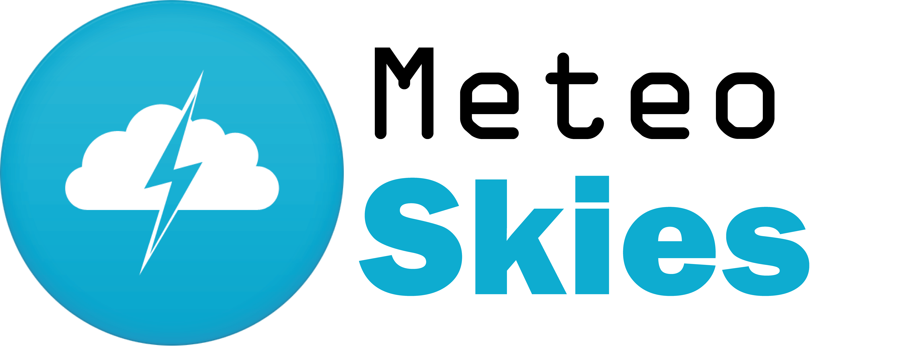

# 🌤️ MeteoSkies

**MeteoSkies** to aplikacja webowa stworzona w React, służąca do sprawdzania aktualnej pogody oraz prognozy dla wybranych miast. Projekt został wykonany w ramach zaliczenia z przedmiotu **Programowanie Frontend**.

## ✨ Funkcjonalności

### Wymagania konieczne (zrealizowane)
- Wyświetlanie listy miast na ekranie głównym  
- Podgląd szczegółów pogody dla wybranego miasta:
  - aktualna temperatura,
  - aktualne warunki pogodowe (ikony),
  - prognoza na **5 kolejnych dni**,
  - prawdopodobieństwo i suma opadów,
  - prędkość i kierunek wiatru,
  - stopień zachmurzenia
- Nawigacja pomiędzy podstronami (React Router)
- Reużywalne komponenty
- Stylowanie przy użyciu CSS

### Funkcjonalności dodatkowe
- Globalna zmiana jednostek temperatury (**°C / °F**)  
- Wyszukiwanie miast z podpowiedziami (Open-Meteo Geocoding API)  
- Oznaczanie miast jako ulubione (❤️)  
- Zapisywanie stanu aplikacji w `localStorage`:
  - zapisane miasta,
  - wybrana jednostka temperatury

## 🛠️ Technologie
- **React + TypeScript**
- **React Router**
- **Open-Meteo API** (prognoza pogody i geokodowanie)
- CSS (bez frameworków UI)

## 📦 API
Aplikacja korzysta z publicznego API:
- https://open-meteo.com/

## 📌 Status projektu
Projekt spełnia wszystkie wymagania funkcjonalne z sekcji *Wymagania konieczne* oraz część wymagań dodatkowych.  
Nie zastosowano biblioteki **Redux** (stan globalny zarządzany jest przez React + localStorage).

## 🎓 Kontekst akademicki
Projekt wykonany zgodnie z wytycznymi projektu semestralnego z kursu *Programowanie Frontend* :contentReference[oaicite:0]{index=0}
